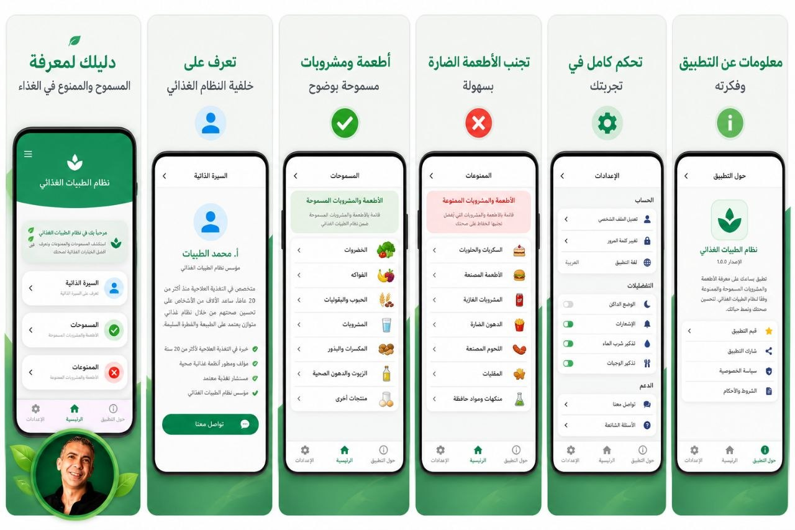

🛍️ Tayyibat App

A modern Flutter mobile application for discovering food, services, and lifestyle categories such as restaurants, stores, gyms, clinics, and honey products.

---

📱 About the App

Tayyibat is a Flutter-based mobile application published on Google Play.

It helps users explore multiple categories of services in a clean, fast, and modern user interface.

The application is designed with scalability, performance, and smooth user experience in mind.

---

✨ Features

- 🍽️ Browse restaurants and food services
- 🏪 Discover stores and local shops
- 🏋️ Find gyms and fitness centers
- 🏥 Explore clinics and health services
- 🍯 Explore honey and natural products
- ⚡ Fast and responsive user interface
- 📱 Cross-platform support (Android, iOS, and Web)

---

🛠️ Built With

- Flutter
- Dart
- Material Design

---

📸 Screenshots

  
  
  

  
  

---

🚀 Google Play

🔗 "Download Tayyibat App on Google Play" (https://play.google.com/store/apps/details?id=com.tayyibat.app)

---

⭐ Highlights

- Clean and scalable architecture
- Production-ready Flutter application
- Optimized performance and smooth UI
- Structured for future expansion
- Published on Google Play Store

---

👨‍💻 Developer

Mohamad Sabry

- Flutter Developer
- Mobile App Developer
- Open to freelance and professional opportunities

---

📦 Project Status

✔ Published on Google Play

✔ Actively Maintained

✔ Production Ready

✔ Continuous Improvements

---

🚀 Future Improvements

- User Authentication System
- Backend & API Integration
- Push Notifications
- Local Caching & Performance Optimization
- Additional Service Categories
- Enhanced Search Experience

---

🔧 Getting Started

Clone the repository:

git clone https://github.com/mohamadsabry2040-cmd/Tayyibat.git

Install dependencies:

flutter pub get

Run the application:

flutter run

---

📄 License

This project is intended for personal, educational, and portfolio purposes.
